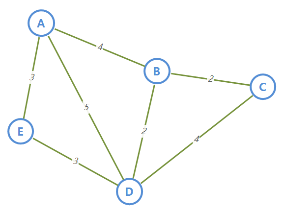
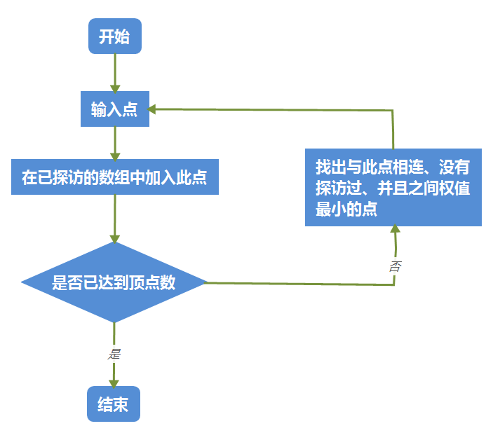

## 一、概念

Prim（普里姆）算法，是在加权连通图内搜索最小生成树。

得到的是顶点连通顺序，并且权值最小。


此算法核心代码只有几行，先分享一下，提高大家的阅读兴趣，毕竟太长的代码谁也不怎么想读：

```javascript
if(data[visited[i]][j] > min_num && noExist(visited, j) && data[visited[i]][j] < min) {
    min = data[visited[i]][j]
    visited[i+1] =  j
}
```


如果说上面内容看的不太明白，这不是问题，接下来我们根据具体情况来解析这个算法，从结果入手，看完实例你就懂了。

## 二、初步解析

为了突出重点，直接给定加权连通图及其连接矩阵：以下就是我们的测试数据



（加权连通图）

上面这个图，我们输入 A 点，经过 Prim 算法后，会输出：

```javascript
A -> E -> D -> B -> C
```


从这个结果你能看出什么端倪吗？

与 A 有连接的一共有 3 个点，B 点、D 点和 E 点，为什么 A 接下来 E 点？因为 AE 之间的权值是 3 ，比 AB 的权值（4）、AD 的权值（5）都要小。所以 A -> E 。

与 E 有连接的一共有 2 个点，A 点， D 点。而 A 点我们之前已经访问过了！所以就是 A -> E -> D。

与 D 有连接的一共有 4 个点，A点，B 点， C 点， E 点。而 A 点、E 点我们之前已经访问过了，所以在 B 点和 C点之间进行选择，BD < DC，所以是  A -> E -> D -> B。

...

结果就是 A -> E -> D -> B -> C


从这里也就可以看出算法的核心了，通过**核心点**，选出**目标点**，而目标点需要满足与未被访问过、与核心点有连接，权值最小的这三个条件，再将**目标点**作为**核心点**，选出下一个**目标点**，直到所有点都被探访过。

## 三、流程图

这是这个算法的流程图：



（Prim 算法流程图）


我们为了确保每个目标点都没有被访问过，所以加入了一个记录**已探访**点的数组。每次得到**核心点**，就首先加入到已探访的数组内。（ let 是 JavaScript 的一个语法，类似于 var， int 等等，定义一个变量，并且在 JavaScript 中数组是动态增长的，不需要给定长度）

```javascript
let visited = [] //记录已经探访过的点
```

与核心代码的关系：

```javascript
noExist(visited, j) // noExist() 是自定义的一个方法，是确认 j 点是否在 visited 这个数组内
```

辅助函数：（JavaScript 中的参数，不需要定义数据类型，变量也不用）

```javascript
// num 这个数字是否没有存在于 arr 这个数组内部
function noExist(arr, num) {
    for(let i = 0; i< arr.length; i++) {
        if(arr[i] == num) {
            return false
        }
    }
    return true
}
```


上述图中有一个判断：是否已达到顶点数。这其实是一个伪命题，我们为了找到确认每个点的访问顺序，基本需要对每一个点都进行操作，所以我们需要一个循环，而循环次数就是**顶点数 -1** 。

我们设置顶点数为 n。

```javascript
const n = data.length // 获得顶点数, data 是邻接矩阵，它的长度就是顶点数
```

这里有些朋友可能会疑惑，为什么循环次数是 n -1，不是有 n 个点吗？你可以想想，一开始我们自己输入的点（也就是自定义的起始点），不就已经确认了一个点了吗，循环次数肯定就比顶点数少 1 了。

```javascript
for(let i = 0; i < n-1; i++) {
    // i 表示第 i 个点
} //这是第一层循环，确认核心点
```

## 四、数据

在准备进入代码详解部分之前，先整体说说我们需要定义哪些数据：

```javascript
let min_num = -1, // 两个点之间没有连接
    max_num = 999, // 最大的权值
    data = [
        [min_num, 4, min_num, 5, 3],
        [4, min_num, 2, 2, min_num],
        [min_num, 2, min_num, 4, min_num],
        [5, 2, 4, min_num, 3],
        [3, min_num, min_num, 3, min_num]
    ] // 邻接矩阵
```

min_num ：表示两个顶点之间没有连接，也就是没有边。

max_num：表示边的最大权值，目的是为了获得最小的权值。

data： 表示邻接矩阵，其中用 min_num 表示了没有边的情况。

与核心代码的关系：

```javascript
let min = max_num // 将最大的权值赋值给当前的最小权值
for(let j = 0; j < n ; j++) {
    // 如果 i 和 j 点之间有连接，并且 j 点没有被访问过，与 i 点的连接的权值小于目前的最小权值
    if(data[visited[i]][j] > min_num && noExist(visited, j) && data[visited[i]][j] < min) {
        ...
    }
} //第二层循环，确认目标点
```

visited[]：记录已探访过的点，上一部分已经解释过啦，不明白翻上去再看看~

## 五、算法详解

这个算法的核心是，贪心算法。

### 算法外观

```javascript
function Prim(data, num){
    ...
}
```

我们需要一个 data 数组，也就是一个邻接矩阵（记录着我们有权连通图的数据）；

一个 num ，也就是起始点，我们自定义的起始点，ABCDE 在邻接矩阵中的顺序不就是 01234 吗，我们直接使用这个顺序数字代表顶点。

如果需要输入 “A”、“B” 这样得顶点名称来确认点，自己写一个转换模块就好啦，降低耦合性

### 数据初始化

```javascript
function Prim(data, num){
    let visited = [] //复原，表示还没有点被访问过
    const n = data.length // 获得顶点数
    visited[0] = num; //这个点已经被访问（起始点）
	
    ...
}
```

我们先将 visited[] 这个数组复原，也就是清除原先的数据。

用 n 代表顶点数，确定循环次数。

将起始点赋值给 visited[] 数组，表示这个点我们已经访问过了。

### 进入第一层循环

```javascript
function Prim(data, num){
    let visited = [] //记录已经探访过的点
    const n = data.length // 获得顶点数
    visited[0] = num; //这个点已经被访问（起始点）

    for(let i = 0; i < n-1; i++) {
        // i 表示第 i 个点
        let min = max_num // 设置最大的权值，为获得最小的权值
        ...
    }
}
```

这里 i 是代表第 i 个点，控制循环次数，并且通过这个 i 值可以在 visited[] 数组中得到核心点（记得数据初始化时，我们的 visited[0] = num 吗）。是 data 数组中的一维层次。

max_num 是最大的权值，赋值给 min 这个变量。

min 是代表与 i 点有关的各个点中，权值最小值，是作为一个判断条件的，其值需要不断修正。


此层循环是为了控制循环次数，得到核心点。

### 进入第二层循环

```javascript
function Prim(data, num){
    let visited = [] //记录已经探访过的点
    const n = data.length // 获得顶点数
    visited[0] = num; //这个点已经被访问（起始点）

    for(let i = 0; i < n-1; i++) {
        // i 表示第 i 个点
        let min = max_num // 设置最大的权值，为获得最小的权值
        for(let j = 0; j < n ; j++) {
            ...
        }
}
```

这层循环的意义在于，遍历核心点相关的点，得到目标点。

其中 j 代表 j 点。是 data 数组中的二维层次。

i 点和 j 点之间有没有连接，j 点有没有被访问过，i 点和 j 点直接的权值是多少，是不是与 i 点相连接的点中最小的那个权值。

### 获得目标点

```javascript
function Prim(data, num){
    let visited = [] //记录已经探访过的点
    const n = data.length // 获得顶点数
    visited[0] = num; //这个点已经被访问（起始点）

    for(let i = 0; i < n-1; i++) {
        // i 表示第 i 个点
        let min = max_num // 设置最大的权值，为获得最小的权值
        for(let j = 0; j < n ; j++) {
            // 如果 i 和 j 点之间有连接，并且 j 点没有被访问过，与 i 点的连接的最小权值
            if(data[visited[i]][j] > min_num && noExist(visited, j) && data[visited[i]][j] < min) {
                min = data[visited[i]][j]
                visited[i+1] =  j
                }
            }
        }
    return vistied
}
```

如果如果 i 和 j 点之间有连接，并且 j 点没有被访问过，比当前与 i 点的连接的最小权值还小，就将当前的最小权值改为此时 i 点和 j 点的权值，并且修改 visited[] 数组。


最后得到的就是符合条件的目标点，然后将此目标点作为核心点，再寻找目标点。

完成。


## 六、最后

代码可以优化的地方还有很多，最主要的是理解 Prim 这个算法的思想，不断找寻最小权值的点，其实就是贪心算法。