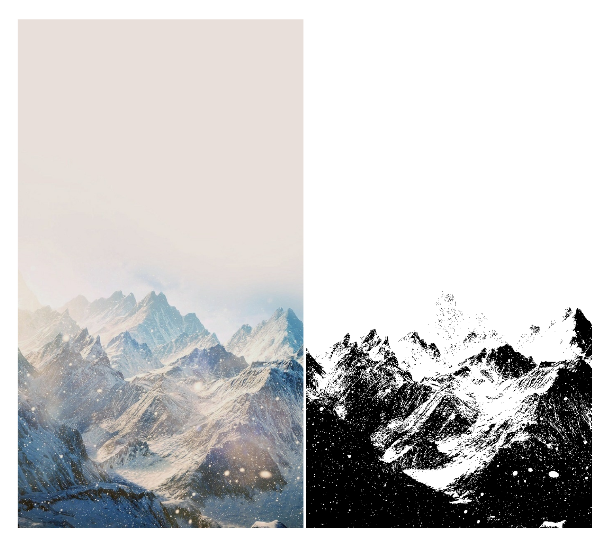

# Otsu 灰度图像阈值算法

人工智能导论课的第一次作业。

## 一、简介

我们要做的，其实就是将一张（彩色）图片，转成黑白图片（二值图）。

> 二值图：只有黑色或白色，`000` 或 `fff`，`0` 或 `255`。

看看效果图就基本了解了，左原图，右图经过算法处理：



（原图为网络收集图 侵权删）

在彩色图和黑白图片之中，还有一个灰度图。

这个灰度图是我们这次的主角。


## 二、概念

### 1. 像素与色彩

每张图片是由多个像素点构成的，比如长 `200`， 宽 `200` ，那么它就有 `40000` 个像素点。

每个像素点都有自己的颜色，每个颜色又都有不同的值，那么要怎么将缤纷五彩变为“非黑即白”？


以 `RGB` 来表示每种颜色，即三原色（红绿蓝）各自的比例，比如白色的 `RGB` 是 `(255,255,255)`，如果用十六进制来表达就是 `#ffffff`（可简写为 `#fff` ），黑色的 `RGB` 是 `(0,0,0)` ，`#000`。

> `RGBA` ，在原来的基础上，加上了 `alpha` ，用来设置透明度的。一般一个像素点含有四个数值。
>
> 所有数值范围：`0` ~ `255`，共 `256` 个。

更改图片颜色，就是分别更改它们每个像素点的 `R`、 `G`、 `B` 的具体数字！	

推荐一篇文章：[彩色图像怎样转灰度图像](<https://blog.csdn.net/saltriver/article/details/79677116> ) ，它的第四部分“二值图像” ，其实就是这个题目的含义。

### 2. Otsu

一个算法名称。

它是计算一个阈值（临界值）的算法。

### 3. 灰度 grayscale

用不同饱和度的黑色来显示图像。最高的灰度就是黑，最低的灰度就是白。

每个像素点的灰度值要怎么计算？

通常是采用平均数法，也就是 `Gray = (R+G+B)/3` 。

再用计算出来的 `Gray` 替换掉对应像素点的 `R` 、`G`、 `B`  三个数，就会得到灰度图了。

### 4. 阈值 threshold

临界值。

我们现在已经有了每个像素点的灰度值，但二值图，黑白是两个极端。

所以我们需要一个临界值来分隔它们，灰度值大于这个临界值的，`RGB` 三个值均设为 `255` （或 `0`），小于这个临界值的，`RGB` 三个值均设为 `0` （或`255`）。

这个临界值，也就是题目中的阈值，该设置为什么，就是 Otsu 算法要解决的问题。

### 5. 关键词总结

`RGB` ：色彩标准，红绿蓝

`Otsu` ：算法名称，计算阈值的算法。

`grayscale  `：灰度值。

`histogram` ：直方图，用于统计图像中灰度数据，便于计算灰度的频率分布、平均值等。

`prob` ：频率分布，`每部分的 histogram / 总数`

`threshold ` ：门槛，界，也就是标题中的“**阈值**”

## 三、题目

图像有 `L` 阶灰度， `ni` 是灰度为 `i` 的像素数，图像总像素数有 `N = n1 + n2 + ··· + nL`

灰度为 `i` 的像素概率：`pi = ni / N`

类间方差：`ICV = PA * (MA - M) * (MA - M) + PB * (MB - M) * (MB - M)`

强烈推荐阅读此篇文章：[灰度图像的自动阈值分割（Otsu 法）](https://blog.csdn.net/liyuanbhu/article/details/49387483)，一篇就能理解题目含义。

## 四、步骤解析

部分将结合已实现效果的代码进行解释。

且基本上一个小节的返回值就是下一小节的参数。

### 1. 获得图像数据

即每个像素点的数据值。

因为我是采用 `JavaScript` 的 `Canvas` 来实现的，所以为 `ImageData` 对象，它的 `data` 属性为一个数组，数组的数据就是此图像的所有像素点的值，且每 `4` 个值为一个像素点（`RGBA`）。

```javascript
let imageData = getImageData(oRawImg)
// 获得图像数据
function getImageData(raw) {
    ...
	return ctx.getImageData(0, 0, width, height)
}
```

### 2. 获得灰度值

通过对 `图像数据` 每四个值的一次处理，最终获得原 `图像数据` 的 `1/4` 长度数组。

> `grayscale` ： 灰度值

```javascript
let grayscale = getGrayscale(imageData)
// 获得灰度值
function getGrayscale(imageData) {
	let grayscale = [],
	data = imageData.data
	for (let i = 0; i < data.length; i += 4) {
         ...
         gray = Math.round((r + g + b) / 3)
		grayscale.push(gray)
	}
	return grayscale
}
```

### 3. 获得灰度直方图

一张长宽都只有 `200` 的图像，就有 `40000` 个像素点，灰度值数组长度就为 `40000` 。

而灰度值只有 `256` 种，所以我们来统计每个灰度值有多少个像素点，便于后续计算（逐渐走向数学知识）。

> `histogram`：直方图

```javascript
let histogram = getHistogram(grayscale)
// 获取直方图
function getHistogram(grayscale) {
	...
	for (let i = 0; i < grayscale.length; i++) {
		histogram[grayscale[i]]++
	}
	return histogram
}
```

### 4. 获得概率密度

概率密度，就是对应位置的灰度个数除以所有的灰度个数。

即为此灰度值的概率为多少。

> `prob` ：` Probability Density `，概率密度

```javascript
let prob = getProb(histogram, grayscale.length)
// 获得概率密度
function getProb(histogram, n) {
	...
		prob[i] = histogram[i] / n
	}
	return prob
}
```

### 5. 获得阈值

通过 Otsu 算法来获得。套个外套，易理解。

```javascript
let threshold = getThreshold(prob)
// 套个外套，易理解
function getThreshold(prob) {
	return otsu(prob)
}
```

### 6. Otsu 算法

关键在于 `ICV = PA * (MA - M) * (MA - M) + PB * (MB - M) * (MB - M)` 这个公式，以下逐个解释其意义。

#### 累积分布

`cum`， 为`Cumulative Distribution Function ` 的代替，通过不断累加概率密度得到，是为了获得 `PA` 和 `PB`。

`PA` + `PB` = `1`，这两个数值的意义是，阈值左右两边的比例，A 部分， B 部分。

> A 部分里的像素数占总像素数的比例记作 PA，B 部分里的像素数占总像素数的比例记作 PB。 

```javascript
cum = new Array(256)
cum[0] = prob[0]
cum[i] = cum[i - 1] + prob[i]

PA = cum[i]
PB = 1 - PA
```

#### 灰度总平均值

`M` ，为 `mean` 的缩写，平均值，可在获得 `累积分布` 的同时计算灰度总平均值，`mean` 数组的最后一个值就是总灰度平均值。

> M = (a + b + c) / 3 = a / 3 + b / 3 + c / 3

```javascript
M = 0
mean = new Array(256)
mean[0] = 0
mean[i] = mean[i - 1] + i * prob[i]
M = mean[255]
```

#### 类间方差

`ICV` ，为 `inter-class variance` 的缩写，类间方差。

 `MA` 和 `MB` 为：`A` 部分的灰度平均值， `B` 部分的灰度平均值。

> A， B 两部分各自的平均值为 MA 和 MB。 

```javascript
MA = mean[i] / PA
MB = (M - mean[i]) / PB
ICV = PA * (MA - M) * (MA - M) + PB * (MB - M) * (MB - M)
```

最后使 `ICV` 值最大的那个灰度值，就是阈值。

### 7. 输出图像

将原始图像数据、灰度值、阈值、和目标位置作为参数。

```javascript
function putImageData(imageData, grayscale, threshold, ctx) {
    	...
        let gray = grayscale[i / 4] > threshold ? 255 : 0
        data[i] = data[i + 1] = data[i + 2] = gray
    }
    ctx.putImageData(imageData, 0, 0)
}
```

## 五、代码相关

本是写了非常详细的注释，但因个人失误导致注释丢失。

幸运的是，代码是按照逻辑顺序进行调用、排序的，按照顺序读下去即可；函数名与参数即是其功能。若不太理解单词请翻阅上文内容。

## 六、参考资料

1. [灰度图像的自动阈值分割（Otsu 法）](https://blog.csdn.net/liyuanbhu/article/details/49387483)
2. [彩色图像怎样转灰度图像](<https://blog.csdn.net/saltriver/article/details/79677116> ) 
3. [百度百科-灰度值](<https://baike.baidu.com/item/%E7%81%B0%E5%BA%A6%E5%80%BC/10259111?fr=aladdin> )
4. [Otsu-s-Thresholding](<https://github.com/IAmEnchant/Otsu-s-Thresholding> )
5. [MultiOtsuThresholdJS](<https://github.com/hipersayanX/MultiOtsuThresholdJS> )